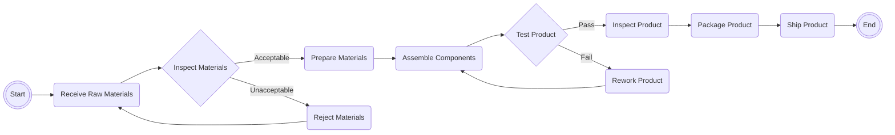

# Operations-Management

## What is a process flow?
In operations management, a process flow refers to the sequence of activities or steps that are followed to transform inputs into outputs within an organization. It outlines the movement of materials, information, and resources through various stages of a process or operation. A process flow typically includes the following components:

1. `Inputs`: These are the resources, materials, information, or data that are required to initiate the process. Inputs can include raw materials, components, energy, equipment, and human resources.

2. `Activities/Steps`: These are the individual tasks or operations that are performed to convert inputs into outputs. Each step in the process flow represents a specific action or operation that contributes to the overall process.

3. `Controls`: Controls are checkpoints or measures implemented within the process flow to ensure quality, efficiency, and adherence to standards. They help in monitoring and regulating the process, identifying deviations or issues, and taking corrective actions if necessary.

4. `Outputs`: These are the final results, products, or services generated by the process. Outputs can be tangible goods, such as manufactured products, or intangible deliverables, such as reports or services.

5. `Feedback`: Feedback loops are an essential part of the process flow, allowing for continuous improvement. Feedback can come from various sources, such as customers, employees, or performance metrics, and it provides information for evaluating and refining the process.

Process flows are often represented using diagrams or flowcharts, which visually illustrate the sequence of steps and the relationships between them. Flowcharts use symbols and arrows to represent activities, decisions, inputs, outputs, and the flow of information or materials.

By analyzing and optimizing process flows, operations managers aim to enhance productivity, reduce costs, improve quality, minimize waste, and streamline operations within an organization. They identify bottlenecks, inefficiencies, or redundancies and implement strategies to optimize the process and achieve operational goals.

## What does a process flow diagram look like?
```rust
Start --> Receive Raw Materials --> Inspect Materials --> Prepare Materials --> Assemble Components --> Test Product --> Inspect Product --> Package Product --> Ship Product --> End
```



A process flow diagram (PFD) is a visual representation of the steps or activities involved in a process or system. It uses standardized symbols and connectors to illustrate the flow of materials, information, or resources. Process flow diagrams can be as simple or complex as needed, depending on the level of detail required to understand and analyze the process. They provide a visual representation that helps stakeholders, team members, or process owners to comprehend the process and identify areas for improvement or optimization.

## Flow Units
In a process flow, flow units refer to the entities or items that move through the process or system being analyzed. Flow units can be physical items, such as products or materials, or they can be abstract entities, such as information packets or requests.

Flow units are used to measure the throughput, performance, and efficiency of a process. By tracking the flow units through different stages or activities, managers can gain insights into the rate at which the process is able to produce or deliver the desired outputs.

The analysis of flow units allows managers to assess the performance of a process, identify bottlenecks or inefficiencies, and make improvements to enhance productivity, quality, and customer satisfaction. By understanding how flow units move through a process and where delays or disruptions occur, managers can optimize the process flow, allocate resources effectively, and streamline operations.

## Buffers
In a process flow, buffers are temporary storage or waiting areas designed to absorb variations or imbalances in the flow of materials, information, or work units. Buffers help to decouple different stages of a process, ensuring that disruptions or delays in one stage do not immediately impact subsequent stages.

Buffers serve several important functions within a process flow:

1. `Smoothing Flow`: Buffers help to smooth out variations in the flow of work units or materials. They can absorb fluctuations in supply or demand, allowing the process to continue operating smoothly even when there are temporary imbalances.

2. `Reducing Waiting Time`: Buffers can reduce waiting times between process steps. If one stage of the process is temporarily delayed, the buffer can hold the flow units until the next stage is ready to receive them. This helps to minimize idle time and keep the overall process moving efficiently.

3. `Enabling Parallelism`: Buffers enable parallelism by allowing different stages of the process to operate concurrently. Instead of waiting for one stage to complete before starting the next, buffers facilitate independent operation, leading to faster overall process throughput.

4. `Providing Flexibility`: Buffers provide flexibility in managing variations in capacity or demand. They act as a cushion against unexpected fluctuations, allowing the process to adapt to changing conditions without disrupting the overall flow.

5. `Facilitating Control and Feedback`: Buffers create opportunities for control and feedback in the process. By monitoring the level of buffer utilization, managers can gain insights into the performance of different stages, identify bottlenecks, and make informed decisions for process improvement.

Buffers can take various forms depending on the nature of the process. They can be physical storage areas, such as inventory or warehouse space, where materials are held until they are needed in the next stage. In information systems or data processing, buffers can be digital storage or memory space used to store and manage data or work in progress. Buffers help to enhance the efficiency, resilience, and flexibility of a process flow by providing a mechanism to absorb variability and maintain the continuous flow of work units or materials.

## Activity
An activity refers to a specific task, operation, or step that is performed as part of the overall process. It represents an individual action or work element that contributes to the transformation of inputs into outputs.

Activities are the building blocks of a process and define the sequence of actions required to complete the process. Each activity in a process flow typically has a specific purpose, such as processing, assembling, inspecting, testing, packaging, or transporting.

Below are a few key characteristics of activities in a process flow:

1. `Execution`: Activities represent the actual execution of work. They involve the allocation of resources, such as labor, equipment, or materials, to perform a particular task.

2. `Time and Duration`: Each activity has a certain duration or time required to complete it. The duration may vary depending on factors such as complexity, volume, or skill level.

3. `Order and Sequence`: Activities in a process flow are organized in a sequential order to ensure the logical progression of work. The sequence of activities determines the flow and dependencies between different steps.

4. `Inputs and Outputs`: Activities receive inputs, such as raw materials, information, or data, and transform them into outputs, which can be intermediate or final products, completed tasks, or information for the next stage of the process.

5. `Controls and Quality`: Activities may have controls or checkpoints in place to ensure quality and adherence to standards. Controls can include inspections, testing, verification, or approval processes.

6. `Roles and Responsibilities`: Activities are typically assigned to specific individuals or roles responsible for their execution. Clear assignment of activities helps in accountability and coordination within the process flow.

Activities can be represented in a process flow diagram or flowchart using symbols, such as rectangles or squares, with labels indicating the specific task or operation being performed. The flowchart visually depicts the sequence of activities and their relationships within the overall process.

By understanding and analyzing activities in a process flow, organizations can identify opportunities for improvement, optimize resource allocation, streamline operations, and enhance overall efficiency and effectiveness.

## Flow Time
Flow time, also known as cycle time or throughput time, refers to the total time it takes for a flow unit (e.g., a product, service, or task) to go through an entire process or system. It measures the elapsed time from when a flow unit enters the process until it exits as a completed output.

Flow time includes all the time spent on activities, waiting, queuing, and any other delays experienced by the flow unit during its journey through the process. It is a comprehensive measure that considers both the productive time (time spent on value-adding activities) and non-productive time (time spent on waiting, inspections, transportation, etc.) within the process.

Understanding flow time is crucial for assessing process efficiency, identifying bottlenecks, and making improvements. It allows organizations to evaluate the speed and timeliness of their operations, optimize resource allocation, and meet customer expectations.

Some of the most important concepts related to flow time are below:

1. `Total Flow Time`: It represents the overall time from the start of the process until the completion of the flow unit. It includes all the time spent on activities and any waiting or queueing time in between.

2. `Active Time`: This refers to the time spent on value-adding activities or tasks that directly contribute to the transformation of inputs into outputs.

3. `Wait Time`: Wait time refers to the time a flow unit spends waiting in queues or buffers between different stages or activities within the process. It can be caused by bottlenecks, resource limitations, or imbalances in the flow.

4. `Idle Time`: Idle time represents the unproductive time when a flow unit is not actively being worked on or waiting in a queue. It can occur due to equipment breakdowns, lack of resources, or other disruptions.

By analyzing/calculating the flow time, organizations can identify process inefficiencies, potential areas for improvement, and strategies to reduce delays, idle time, and overall lead time. Reducing flow time can lead to increased productivity, improved customer satisfaction, shorter delivery times, and better overall process performance.

## Flow Rate
In a process context, flow rate refers to the rate at which flow units (such as products, services, or tasks) move through a process or system. It quantifies the amount of flow units processed per unit of time, indicating the volume or quantity of work completed within a given timeframe.

Flow rate is a crucial metric in operations management as it provides insights into the capacity and efficiency of a process. It helps organizations assess the throughput of their operations, identify bottlenecks, and make informed decisions to optimize productivity and resource allocation.

Here are a few key points to understand flow rates:

1. `Measurement`: Flow rate is typically measured as the number of flow units completed or processed per unit of time. For example, it can be expressed as products produced per hour, customer orders fulfilled per day, or tasks completed per week.

2. `Throughput`: Flow rate represents the actual rate at which work units pass through a process. It considers the time required for each flow unit to move through the entire process and become a completed output.

3. `Variability`: Flow rate can be affected by variations in the arrival rate of flow units, process cycle times, and any disruptions or delays in the process. Variability can impact the consistency and predictability of flow rates.

4. `Capacity and Bottlenecks`: Flow rate is closely tied to the capacity of the process. Bottlenecks occur when the flow rate of a particular stage or resource limits the overall flow rate of the process. Identifying and resolving bottlenecks is essential for optimizing flow rates.

5. `Relationship with Flow Time`: Flow rate and flow time (cycle time) are interrelated. Flow rate is the inverse of flow time, indicating the reciprocal relationship between the two. Increasing the flow rate can reduce flow time and vice versa.

## Little's Law
Little's Law is a fundamental concept in queuing theory that relates the average number of customers (or flow units) in a system, the average arrival rate of customers, and the average time a customer spends in the system. It provides a mathematical relationship that helps analyze and understand the behavior of queues and waiting times in a variety of systems.

The law is named after John Little, who introduced it in 1961. Little's Law is applicable to systems that exhibit stable and predictable behavior, and it is based on three key components:

1. `Number of Customers in the System (L)`: This refers to the average number of customers (flow units) present in the system, including those in service and waiting in queues.

2. `Arrival Rate of Customers (λ)`: This represents the average rate at which customers arrive or enter the system over a given period of time. It is measured in flow units per unit of time.

3. `Time Spent in the System (W)`: This refers to the average time a customer (flow unit) spends in the system, including both waiting time in queues and service time.

Mathematically, Little's Law is expressed as:
```rust
L = λ * W
```

This equation states that the average number of customers in the system (L) is equal to the product of the arrival rate of customers (λ) and the average time spent in the system (W).

Little's Law is a fundamental principle that holds true for a wide range of queuing systems, regardless of their specific characteristics or complexities. It provides insights into the relationship between system performance metrics, such as queue lengths, arrival rates, and waiting times.

Little's Law is valuable for capacity planning, performance analysis, and optimization of systems involving queues, such as call centers, service centers, manufacturing processes, and computer networks. By understanding and applying Little's Law, organizations can make informed decisions to improve efficiency, manage waiting times, and optimize resource utilization in their operations.

## What is a demand-constrained process?
A demand-constrained process refers to a situation where the output or production capacity of a process is limited or constrained by customer demand. In other words, the process is designed or operated in a way that matches the production rate with the level of demand or customer requirements.

In a demand-constrained process, the primary objective is to align the production capacity with the actual demand to avoid overproduction or underutilization of resources. The process is typically designed to be responsive to changes in customer demand and can be adjusted accordingly.

Here are a few key characteristics of a demand-constrained process:

1. `Matching Production to Demand`: The production rate of the process is set to meet the current or anticipated demand levels. The goal is to avoid excessive inventory build-up or shortages.

2. `Flexibility and Responsiveness`: A demand-constrained process is designed to adapt to changes in customer demand. It allows for adjustments in production volume, resource allocation, or scheduling based on demand fluctuations.

3. `Efficient Resource Utilization`: The process optimizes resource utilization by aligning production levels with customer demand. It ensures that resources, such as labor, equipment, and materials, are efficiently utilized without incurring unnecessary costs.

4. `Focus on Customer Satisfaction`: The primary driver of a demand-constrained process is customer satisfaction. The process aims to meet customer expectations by producing the desired quantity of products or services in a timely manner.

5. `Demand Forecasting and Planning`: Accurate demand forecasting and effective demand planning are essential in a demand-constrained process. By understanding customer demand patterns, organizations can make informed decisions regarding production levels, inventory management, and resource allocation.

Demand-constrained processes are commonly observed in industries with highly variable or unpredictable demand, such as retail, hospitality, and seasonal industries. These processes prioritize responsiveness to customer demand while optimizing resource utilization and maintaining operational efficiency.

By operating a demand-constrained process, organizations can effectively manage inventory levels, minimize waste, and enhance customer satisfaction by delivering products or services in line with customer expectations.

## What is a supply-constrained process?
A supply-constrained process refers to a situation where the output or production capacity of a process is limited or constrained by the availability of resources or inputs required for production. In other words, the process is unable to produce at its full potential due to limitations in the supply of necessary inputs.

In a supply-constrained process, the primary focus is on managing and optimizing the utilization of available resources to maximize production output. The process operates at its maximum capacity within the limitations imposed by the availability of inputs. Here are a few key characteristics of a supply-constrained process:

1. `Resource Limitations`: The process faces constraints in terms of the availability of resources, such as raw materials, components, equipment, or skilled labor. The limited supply of these inputs restricts the maximum output that can be achieved.

2. `Production Capacity Utilization`: The process aims to utilize available resources optimally to achieve the highest possible production output. Efforts are made to minimize downtime, improve efficiency, and eliminate bottlenecks to maximize resource utilization.

3. `Strategic Resource Allocation`: Due to limited resources, careful allocation and prioritization of resources become crucial. The process must determine how to allocate resources effectively among different tasks or products to meet demand and optimize overall production output.

4. `Production Planning and Scheduling`: Accurate production planning and scheduling are essential in a supply-constrained process. It involves forecasting resource availability, coordinating production activities, and ensuring efficient utilization of resources within their limitations.

5. `Supplier Management`: Managing relationships with suppliers becomes critical in a supply-constrained process. Ensuring a reliable supply of inputs, negotiating favorable terms, and exploring alternative sources of supply are important strategies to overcome supply constraints.

Supply-constrained processes are often observed in industries where resources are scarce, have long lead times, or are subject to external factors such as supply chain disruptions or market fluctuations. Such processes require careful resource management, strategic decision-making, and continuous improvement efforts to maximize output and meet customer demand.

By operating a supply-constrained process efficiently, organizations can optimize resource utilization, minimize waste, and maximize production output within the limitations imposed by input availability.

## What is a bottleneck?
In a process, a bottleneck refers to a stage, resource, or activity that limits the overall capacity or throughput of the process. It is the point in the process where the flow of work units or materials is restricted, causing a delay or slower pace of production compared to other stages or resources.

Bottlenecks can occur due to various factors, such as limited capacity, slower processing time, resource constraints, or inefficiencies in the process design. They can have a significant impact on the overall performance and efficiency of a process, leading to longer lead times, reduced throughput, increased waiting times, and potential disruptions.

Here are some key characteristics of a bottleneck:

1. `Capacity Limitation`: A bottleneck represents a stage or resource with limited capacity, unable to handle the volume or rate of flow units coming into the process. It acts as a constraint on the overall process output.

2. `Slowing Down the Flow`: The bottleneck stage or resource slows down the flow of work units, causing a backlog or queue to form. The flow units have to wait at the bottleneck, resulting in increased lead time and overall process cycle time.

3. `Influence on Throughput`: The capacity of a process is determined by the capacity of its bottleneck. Increasing the capacity of non-bottleneck stages or resources does not significantly improve the overall process throughput until the bottleneck is addressed.

4. `Critical Impact`: Bottlenecks have a critical impact on the overall performance of a process. Their inefficiency affects the entire process, and any improvement efforts should be focused on alleviating or eliminating the bottleneck.

5. `Shaping Process Design`: Bottlenecks play a significant role in process design decisions. Identifying and understanding bottlenecks help in allocating resources, scheduling activities, and optimizing the process flow to minimize their impact.

To manage and address bottlenecks, organizations can employ various strategies, such as:

- Increasing capacity at the bottleneck stage or resource through process redesign, automation, or investment in additional resources.
- Balancing workloads and optimizing the flow of work units to minimize congestion at the bottleneck.
- Implementing efficient scheduling and prioritization techniques to ensure the bottleneck is utilized effectively.
- Continuous monitoring and analysis of process performance to identify bottlenecks and make data-driven improvements.
By effectively managing bottlenecks, organizations can improve process efficiency, increase throughput, reduce waiting times, and enhance overall productivity.

## What is line balancing?
Line balancing, also known as workload balancing or production leveling, is a technique used in process improvement to optimize the allocation of work tasks or activities along a production line or assembly line. The objective of line balancing is to minimize idle time, reduce bottlenecks, and achieve a smooth and efficient flow of work units through the process.

Line balancing involves distributing the workload evenly across the workstations or operators in a way that maximizes productivity and minimizes imbalances. The goal is to eliminate any excess capacity at some workstations while avoiding overburdening others.

Here are some key aspects of line balancing:

1. `Workstation Allocation`: Line balancing focuses on determining how to allocate work tasks or activities to various workstations or operators within the production line. The goal is to achieve a balanced distribution of workloads based on factors such as task complexity, cycle time, and worker capabilities.

2. `Cycle Time and Takt Time`: Cycle time refers to the time required to complete a specific task or activity, while takt time represents the available time per unit in order to meet customer demand. Line balancing ensures that the cycle times of tasks assigned to each workstation align with the takt time to maintain a smooth flow of work.

3. `Minimizing Idle Time`: Line balancing aims to reduce or eliminate idle time or unproductive time for workers. By properly allocating tasks and ensuring a balanced workload, idle time can be minimized, and workers can remain engaged in value-adding activities throughout the process.

4. `Bottleneck Management`: Line balancing helps identify and address bottlenecks within the production line. By analyzing the workload distribution, organizations can identify stations or activities that impede the flow of work units and take corrective actions to alleviate the bottlenecks.

5. `Efficiency and Productivity`: Line balancing aims to optimize efficiency and productivity by eliminating imbalances, reducing idle time, and improving the overall flow of work. By achieving a balanced workload, organizations can maximize the utilization of resources and minimize waste.

Line balancing techniques include various strategies such as task reassignment, workstation rearrangement, equipment optimization, and workload standardization. Tools like line balancing charts, precedence diagrams, and time-motion studies can be used to analyze and optimize the allocation of tasks and resources. By implementing effective line balancing techniques, organizations can achieve higher productivity, reduced lead times, improved quality, and increased overall process efficiency. It enables smoother operations and better utilization of resources, contributing to enhanced customer satisfaction and cost-effectiveness.

## What is the difference between a job shop and a flow shop?
In the context of process flows, a job shop and a flow shop are two different types of production systems with distinct characteristics. Let's explore the differences between them:

### Job Shop:
- `Customization`: Job shops are characterized by a high level of customization and flexibility. They handle a wide variety of products or services, each requiring different specifications or processes.
- `Unique Orders`: Job shops typically handle orders that are unique or specific to each customer. Production runs are often small and irregular.
- `Process Variability`: The sequence of operations and the routing of jobs can vary significantly based on the specific requirements of each order.
- `Resource Flexibility`: Job shops often have a range of general-purpose equipment and skilled workers capable of performing diverse tasks.
- `Higher Lead Times`: Due to the customization and variability, job shops generally have longer lead times as each order may require different setups and processes.

### Flow Shop:
- `Standardization`: Flow shops are characterized by standardized and repetitive processes. They produce a limited range of products or services with similar characteristics.
- `Assembly Line Structure`: Flow shops typically employ assembly line or production line structures, where products move in a sequential manner from one workstation to another.
- `Fixed Sequence`: The sequence of operations and the routing of work are predetermined and consistent for all products or services.
- `Specialized Equipment`: Flow shops often utilize specialized machinery and equipment that are optimized for the specific production process.
- `Lower Lead Times`: Due to the standardized processes and repetitive nature of production, flow shops generally have shorter lead times compared to job shops.

In summary, the main differences between a job shop and a flow shop lie in the level of customization, process variability, resource flexibility, production structure, and lead times. Job shops prioritize flexibility and customization to meet unique customer requirements, while flow shops emphasize standardization, efficiency, and repetitive processes to achieve high production rates and shorter lead times.

## What is a worker-paced assembly line?
A worker-paced assembly line is a type of production system where the pace of work is determined by the individual worker or operator. In this assembly line setup, each worker performs specific tasks or operations on the product as it moves along the line, and the worker sets the pace at which they complete their assigned tasks.

Key characteristics of a worker-paced assembly line include:

1. `Operator Control`: The individual worker has control over their work pace and determines the speed at which they complete their tasks. They have the flexibility to adjust their pace based on their skill level, comfort, and efficiency.

2. `Autonomy and Responsibility`: Workers are responsible for their assigned tasks and are expected to maintain the quality and accuracy of their work. They have the authority to control their work speed, provided it aligns with overall production requirements.

3. `Variable Cycle Times`: Each worker may have different cycle times (the time required to complete their task) based on their efficiency or the complexity of the task. This can lead to variability in the overall production cycle time.

4. `Balancing Workload`: In a worker-paced assembly line, it is crucial to balance the workload among workers to ensure smooth flow and avoid bottlenecks or idle time. Work distribution and task allocation need to be planned effectively to optimize overall productivity.

5. `Operator Skill Level`: The skill level and experience of workers play a significant role in the performance of a worker-paced assembly line. Operators with higher skill levels can often work at a faster pace and maintain a higher level of productivity.

Worker-paced assembly lines are commonly used in situations where tasks require individual judgment, dexterity, or decision-making, such as intricate assembly processes, manual operations, or customized production. This setup allows operators to maintain a level of control over their work pace and adapt to variations in the production process.

It is important to note that worker-paced assembly lines may have inherent limitations in terms of overall production rate and cycle time consistency compared to systems with fixed-paced or automated assembly lines. Balancing workload, providing training and support, and monitoring productivity are essential considerations for managing worker-paced assembly lines effectively.

## How does the optimization of a process flow differ for a job shop vs a flow shop?
The optimization approaches in job shops and flow shops differ due to variations in customization, process complexity, workload allocation, flexibility, technology integration, and the focus on lead time versus cycle time reduction. Understanding these differences helps tailor the optimization strategies to the specific characteristics and requirements of each type of production system. Let's explore how the optimization approaches vary between the two:

### Process Complexity:
- `Job Shop`: Job shops are characterized by high complexity and customization. Each order or job may have different requirements, processes, and routing. Optimization in a job shop focuses on managing variability, minimizing setup times, and optimizing task sequences to improve overall efficiency and reduce lead times for individual orders.
- `Flow Shop`: Flow shops have a more structured and standardized production flow. The processes are repetitive, and products or services follow a fixed sequence of operations. Optimization in a flow shop aims to minimize bottlenecks, balance workloads, and improve overall flow to increase productivity and reduce cycle times across the entire production line.

### Workload Allocation:
- `Job Shop`: In a job shop, workload allocation involves assigning tasks or jobs to specific workstations or operators based on their skills and capabilities. The optimization focus is on balancing workloads, considering individual work rates, and avoiding bottlenecks or idle time.
- `Flow Shop`: Workload allocation in a flow shop is centered around maintaining a balanced flow of work units across the sequential workstations. The optimization goal is to minimize imbalances, ensure optimal resource utilization, and prevent overloading or underutilization of specific workstations.

### Process Flexibility:
- `Job Shop`: Job shops emphasize flexibility and adaptability to accommodate varying customer demands and unique orders. Optimization in a job shop involves managing flexibility effectively, reducing changeover times, and maximizing resource utilization while maintaining quality and customization.
- `Flow Shop`: Flow shops prioritize standardization and efficiency through a fixed sequence of operations. Optimization in a flow shop focuses on improving process stability, minimizing variability, and maximizing throughput while maintaining quality and adherence to the standardized flow.

### Technology and Automation:
- `Job Shop`: In job shops, technology and automation are often used to support specific tasks or operations rather than fully automating the entire process. Optimization in a job shop involves identifying opportunities for technology integration to streamline specific tasks, reduce errors, and enhance efficiency.
- `Flow Shop`: Flow shops have a higher potential for automation due to the repetitive and standardized processes. Optimization in a flow shop includes evaluating and implementing technology and automation solutions to improve overall process efficiency, increase throughput, and reduce cycle times.

### Lead Time and Cycle Time:
- `Job Shop`: Optimizing lead times in a job shop involves managing the flow of individual orders to reduce waiting times, minimize setup times, and improve overall process efficiency. The focus is on reducing the time it takes to complete a specific order.
- `Flow Shop`: Optimization in a flow shop aims to reduce cycle times by minimizing waiting times, improving flow balance, and eliminating bottlenecks across the entire production line. The focus is on improving the speed and efficiency of the entire production process.
